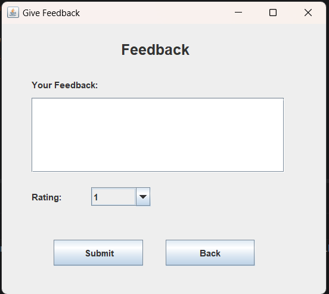

# Library Management System

## 📌 Project Description
A Java-based Library Management System developed using Swing and JDBC. It helps manage books, customers, staff, issue/return operations, and feedback system.

---

## 🚀 Features
- Admin login system
- Add / Delete / Manage books
- Manage staff and customers
- Issue and return books
- Customer registration and login
- Feedback system
- View available books

---

## 🛠️ Tech Stack
- Java (Core + Swing)
- JDBC
- MySQL (if used)
- IntelliJ IDEA

---

## 📁 Project Structure
- src/Service → Business logic
- src/UI → User interface (Admin & Customer)
- src/util → Database connection
- Screenshot/ → UI images

---

## ▶️ How to Run
1. Clone the repository
2. Open in IntelliJ IDEA
3. Configure database (if applicable)
4. Run `Main.java`

---

## 📸 Screenshots

### Login & Customer Flow
| Login Page | Customer Login | Customer Page |
|------------|----------------|---------------|
|  |  |  |

### Book Operations
| View Books | Issue Book | Issue Successful |
|------------|------------|------------------|
|  |  |  |

### Feedback
| Feedback |
|----------|
|  |
